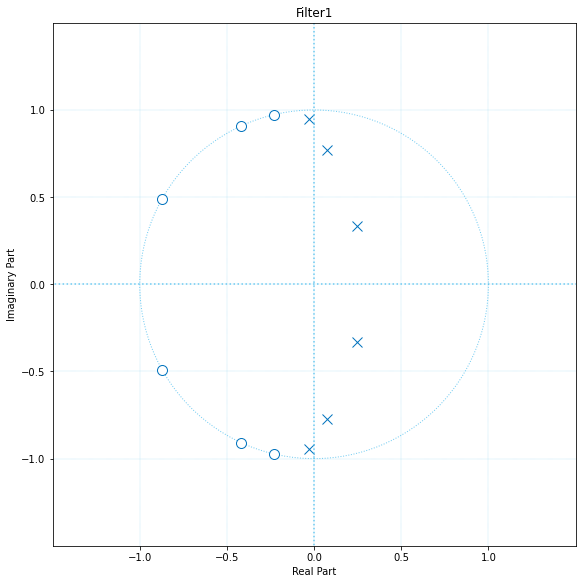
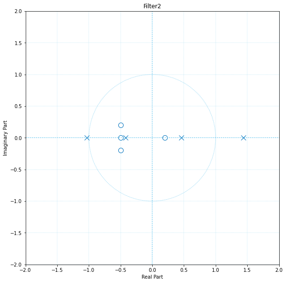
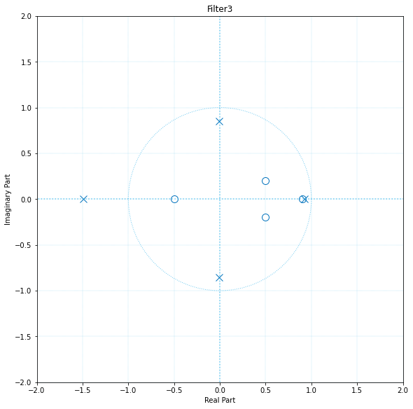

# plot_z_plane

Plot the complex z-plane given a transfer function.    
Plots the zeros Z and poles P with the unit circle for reference.
Each zero is represented with an 'O' and each pole with an 'X' on the plot.    
plot_z_plane(B,A) where B and A are row vectors containing transfer function polynomial coefficients plots the poles and zeros of B(z)/A(z).
### Parameters
    B : Vector of coefficients.
    
    A : Vector of coefficients.
    
    plot_title : String, optional
        DESCRIPTION. Assign title to the plot. The default is 'Z-Plane'.
        
    scaling_factor : Integer, optional
        DESCRIPTION. Scales the plot. The default is 0.

### Usage example

```python 
B1 = np.array([0.0725, 0.2200, 0.4085, 0.4883, 0.4085,    0.2200, 0.0725])
A1 = np.array([1.0000,  -0.5835,  1.7021, -0.8477, 0.8401, -0.2823,   0.0924])

B2 = np.array([1.0000,  1.3000,   0.4900,  -0.0130,  -0.0290])
A2 = np.array([1.0000,   -0.4326,  -1.6656,   0.1253,  0.2877])

B3 = np.array([1.0000, -1.4000,   0.2400,  0.3340,  -0.1305])
A3 = np.array([1.0000,   0.5913,  -0.6436,  0.3803,  -1.0091])

plt.figure(constrained_layout=True, figsize=(10, 8))
plt, ax = plot_z_plane(B1, A1, plot_title='Filter1')

plt.figure(constrained_layout=True, figsize=(10, 8))
plt, ax = plot_z_plane(B2, A2, plot_title='Filter2', scaling_factor=1)

plt.figure(constrained_layout=True, figsize=(10, 8))
plt, ax = plot_z_plane(B3, A3, plot_title='Filter3', scaling_factor=1)
```



